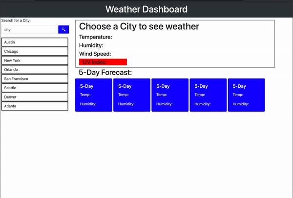

# Weather-Planner

For this assignment we were tasked with making a weather planner. What I did was take a set of popular cities and mad it so that you can click on them to  display all of the info from that city including a 5 day forecast.

Once you search the local storage saves all searches and rht e previous search. You can view the weather temp and humidity.

;